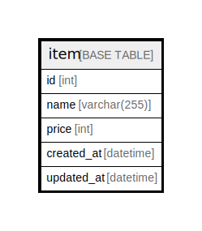

# item

## Description

商品テーブル

<details>
<summary><strong>Table Definition</strong></summary>

```sql
CREATE TABLE `item` (
  `id` int NOT NULL AUTO_INCREMENT COMMENT '商品ID',
  `name` varchar(255) NOT NULL COMMENT '商品名',
  `price` int NOT NULL COMMENT '価格(税込み)',
  `created_at` datetime NOT NULL DEFAULT CURRENT_TIMESTAMP COMMENT '登録日時',
  `updated_at` datetime NOT NULL DEFAULT CURRENT_TIMESTAMP ON UPDATE CURRENT_TIMESTAMP COMMENT '更新日時',
  PRIMARY KEY (`id`)
) ENGINE=InnoDB DEFAULT CHARSET=utf8mb3 COMMENT='商品テーブル'
```

</details>

## Columns

| Name | Type | Default | Nullable | Extra Definition | Children | Parents | Comment |
| ---- | ---- | ------- | -------- | --------------- | -------- | ------- | ------- |
| id | int |  | false | auto_increment |  |  | 商品ID |
| name | varchar(255) |  | false |  |  |  | 商品名 |
| price | int |  | false |  |  |  | 価格(税込み) |
| created_at | datetime | CURRENT_TIMESTAMP | false | DEFAULT_GENERATED |  |  | 登録日時 |
| updated_at | datetime | CURRENT_TIMESTAMP | false | DEFAULT_GENERATED on update CURRENT_TIMESTAMP |  |  | 更新日時 |

## Constraints

| Name | Type | Definition |
| ---- | ---- | ---------- |
| PRIMARY | PRIMARY KEY | PRIMARY KEY (id) |

## Indexes

| Name | Definition |
| ---- | ---------- |
| PRIMARY | PRIMARY KEY (id) USING BTREE |

## Relations



---

> Generated by [tbls](https://github.com/k1LoW/tbls)
